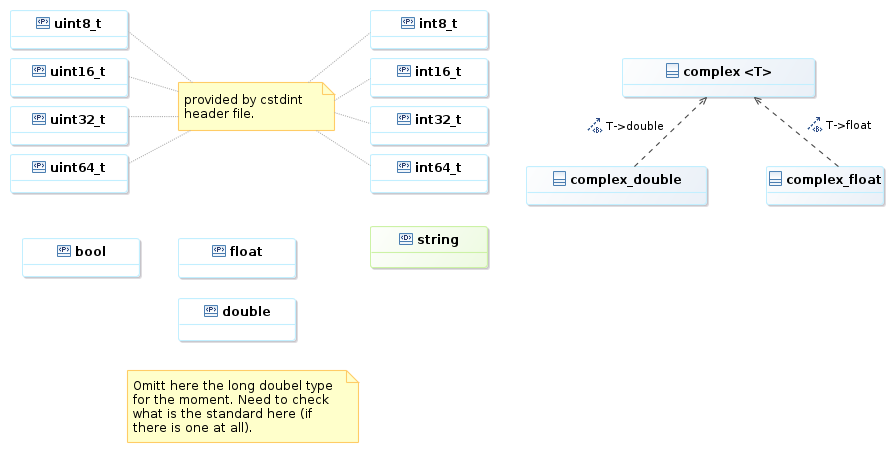

===============
Design overview
===============

.. attention::

    This section provides a more detailed overview about the design 
    concepts of the library. If you are not a software developer who 
    wants to contribute to *libtestdata* you most probably can ommit this 
    chapter.

Supported datatypes
===================

*libtestdata* provides random variables of the following *primitive* types:

   
The term *primitive* should not be considered here as in the sense of *plain old 
data* or *POD* but rather in the sense of elementary types. 
